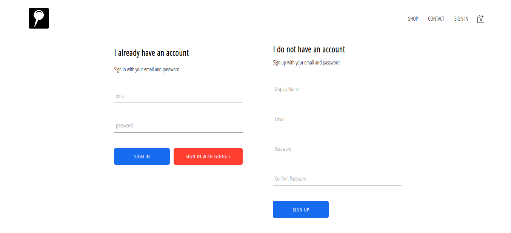

In this e-commerce project, there is navigation and routing that takes us to different pages of categories of items and from these items we can add them to our cart and from that cart, we can see those things directly update and from that cart we're able to checkout, increase or decrease those items again and see the live changes in both our checkout page and our cart page, remove items and integrate with a stripe API so that we can handle payments.

This site is going to be a test version of Stripe because there are no items to ship and I don't want to process real payments because this is just a portfolio project but the matter of switching it is simply a change in the actual stripe website.

This project shows how stripe API works and how things are build using stripe API.
I had also integrated the site with firebase to handle authentication and storage. So with firebase we're able to authorize users using Google so that users can sign in with Google accounts. There is also a sign-in and sign-up feature from where users can directly sign-in and sign-up with email and password. So it's gonna be a fleshed-out fully complete e-commerce platform just like you would build for a real e-commerce company.

## Screenshots of websites

#### Sign in & Sign up page

